### JavaScript 
# POO & LOCALSTORAGE
## OBJECTIFS
Réaliser un Memory, ce jeu où il faut retrouver des pairs de cartes présentées initialement face
retournée.
A travers cet exercice nous manipulerons les notions suivantes :
- Utilisation des modules ES6,
- Programmation orientée objets,
- Utilisation de l’architecture Modèle/Vue/Contrôleur,
- Utilisation de l'API Web LocalStorage.

## UNE CARTE
### MODELE
Implémentation de la classe Card dans le dossier js/models.   

```javascript
export class Card {

    #value;

    constructor(value) {
        this.#value = value;
    }
    get value(){
        return this.#value
    }
}
```
### CONTROLEUR
Ajout de l'attribut card et de la méthode createCard à la classe ControllerMemory dans le dossier js/controllers.   

```javascript
export class ControllerMemory extends Notifier
{
    #card
    constructor()
    {
        super();
    }
    get card(){
        return this.#card
    }
    createCard(){
        this.#card = new Card(Math.floor(Math.random()*243)+0x1F90C)
        this.notify()
    }
}
```

### VUE
Ajout de la méthode displayCard à la classe ViewMemory dans le dossier js/views.  
```javascript
displayCard(){
    const card = this.#controllerMemory.card;
    const cards = document.getElementsByClassName("cards")[0];
    const div =document.createElement("div");
    div.classList.add("card");
    div.innerHTML = "<p>&#x" +  card.value.toString(16) + "</p>";
    cards.appendChild(div);
    div.addEventListener("click", () => this.#controllerMemory.createCard())

}
```
On appelle la méthode displayCard dans la méthode notify de la classe ViewMemory.  
```javascript
notify()
{
    this.displayCard();
}
```
### APPLICATION
On appelle la méthode createCard dans le constructeur de la classe Application.  
```javascript
constructor()
{
    this.#initControllers();
    this.#initViews();
    this.#controllerMemory.createCard();
}
```
Une carte est affichée sur la page web.


## DES CARTES
On modifie le code afin de pouvoir genérer une carte avec une valeur aléatoire à chaque fois qu'on clique sur une carte .
On ajoute donc un EventListener à la div dans la méthode displayCard de la classe ViewMemory:

```javascript
div.addEventListener("click", () => this.#controllerMemory.createCard())
```
On obtient donc une nouvelle carte à chaque clique.

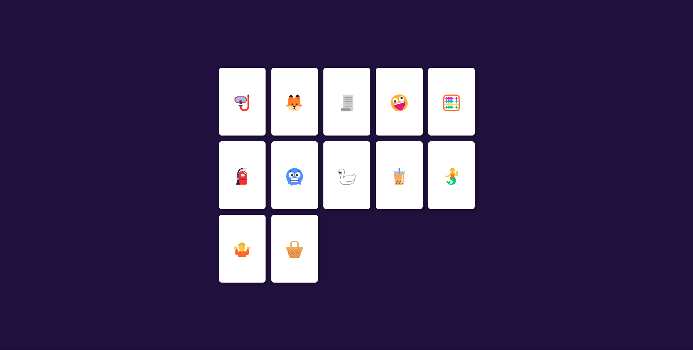

## LE JEU
### MEMORY
On crée une nouvelle classe Memory dans le dossier js/models.  
```javascript
export class Memory{
    #cards

    constructor() {
        this.#cards = [];
    }

    newGame(pairNumber){
        for(let i = 0;i<pairNumber;i++){
            const card1 = new Card(0x1F90C+i);
            const card2 = new Card(0x1F90C+i);
            this.#cards.push(card1,card2);
        }
    }
    getCardsNumber(){
        return this.#cards.length;
    }

    getCard(index){
        return this.#cards[index];
    }
}
```
Pour éviter de déclarer deux cartes avec la même valeur à chaque fois on peut jouer avec le comportement de i pour ne déclarer qu'une carte par boucle:
```javascript
newGame(pairNumber)
    {
        for (let i = 0; i < 2 * pairNumber; i++) {
            const card = new Card(0x1F90C + (i - i % 2) / 2);
            this.#cards.push(card);
        }
    }
```
### CONTROLEUR
On ajoute un attribut memory et une méthode newGame à la classe ControllerMemory.
```javascript
export class ControllerMemory extends Notifier
{
    #memory
    constructor()
    {
        super();
        this.#memory = new Memory();
    }
    get memory(){
        return this.#memory
    }
    newGame(){
        this.#memory.newGame(10);
        this.notify();
    }
}
```
### VUE
on ajoute un argument card à la méthode displayCard de la classe ViewMemory.

```javascript
displayCard(card){...}
```

On ajoute également une méthode displayCards à la classe ViewMemory.
```javascript
displayCards(){
        let memory = this.#controllerMemory.memory
        let length = memory.getCardsNumber();
        for(let i=0;i < length;i++){
            this.displayCard(memory.getCard(i))
        }
    }
```
### APPLICATION
On appelle la méthode newGame dans le constructeur de la classe Application.
```javascript
this.#controllerMemory.newGame();
```
On obtient donc 10 paires de cartes sur la page web.

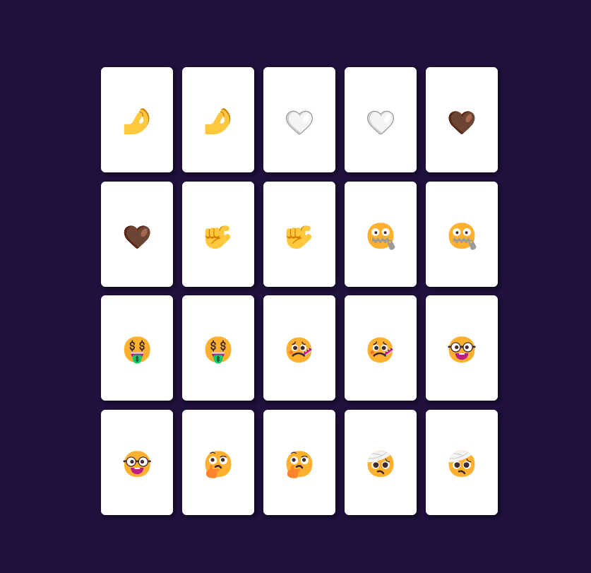

## UN PEU D'ALEATOIRE
On modifie la méthode newGame de la classe Memory pour que les cartes soient mélangées.
```javascript
newGame(pairNumber)
{
    for (let i = 0; i < 2 * pairNumber; i++) {
        const card = new Card(0x1F90C + (i - i % 2) / 2);
        this.#cards.splice(Math.floor(Math.random()*(this.getCardsNumber()+1)),0,card);
    }
}
```
On obtient donc un jeu de cartes mélangées.

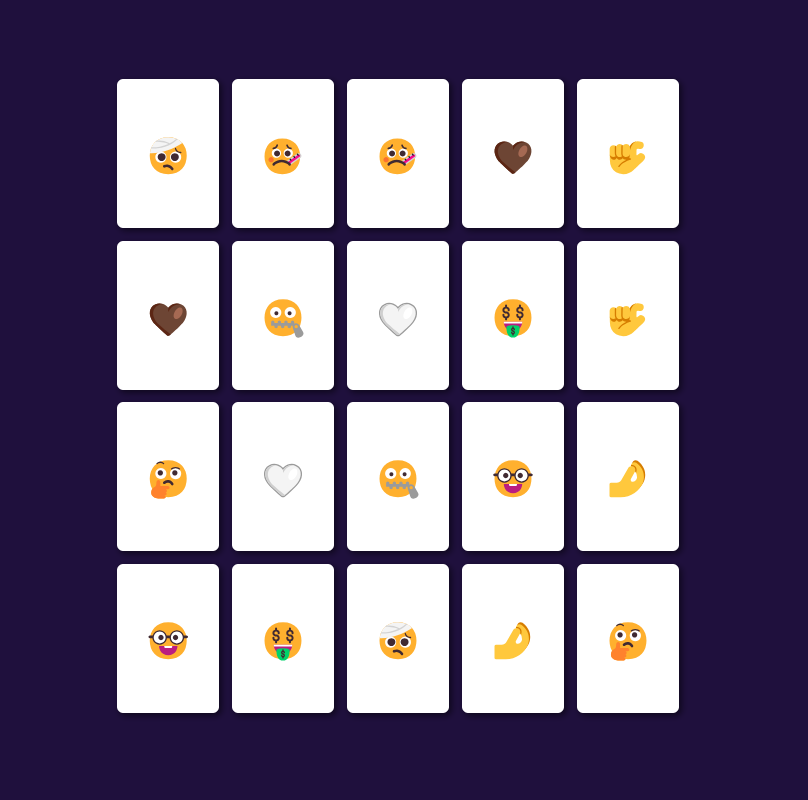

## ENREGISTREMENT
### CONTROLLER
On ajoute une méthode saveGame à la classe ControllerMemory.
```javascript
saveGame()
{
    localStorage.setItem("memory", this.#memory);
}
```
On stocke un objet Object dans le localStorage, ce qui n'est pas le resultat attendu. On doit donc convertir l'objet en chaîne de caractères.

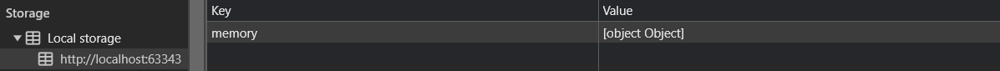

### JSON 
On utilise la méthode JSON.stringify pour convertir l'objet en chaîne de caractères.

```javascript
saveGame()
{
    const data = JSON.stringify(this.#memory);
    localStorage.setItem("memory", data);
}
```

On obtient donc un objet stocké dans le localStorage,or celui-ci est vide car la méthode JSON.stringify ne prend pas en compte les attributs privés.

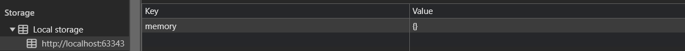

## SERIALISATION / DESERIALISATION
### CARD
On ajoute une méthode toData à la classe Card.
```javascript
    toData(){
    return {
        value: this.#value,
    }
}
```
### MEMORY
On fait de même pour la classe Memory.
```javascript
toData()
{
    const data = {
        cards : []
    }
    for(const card of this.#cards){
        data.cards.push(card.toData());
    }
    return data;
}
```
### CONTROLLER
On modifie la méthode saveGame de la classe ControllerMemory pour enregistrer les données sérialisées.
```javascript
saveGame()
{
    const data = JSON.stringify(this.#memory.toData());
    localStorage.setItem("memory", data);
}
```

C'est bon, on a enregistré les données sérialisées dans le localStorage.

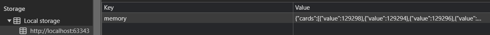

## CHARGEMENT
### MEMORY
On ajoute une méthode fromData à la classe Memory.
```javascript
fromData(data)
{
    this.#cards = [];
    for(const card of data.cards){
        this.#cards.push(card);
    }
}
```
Ici je fait l'erreur de ne pas créer de nouvelle carte mais de push directement l'objet card dans le tableau de carte.
On corrige l'erreur en créant une nouvelle carte avec la valeur de l'objet card avant de la push dans le tableau de carte.

```javascript
    fromData(data){
    this.#cards = [];
    for(const cardData of data.cards){
        const card = new Card(cardData.value);
        if (!cardData.faceHidden) {
            card.show();
        }
        this.#cards.push(card);
    }
}
```
### CONTROLLER
On ajoute une méthode loadGame à la classe ControllerMemory.
```javascript
loadGame()
{
        const jsonData = localStorage.getItem("memory");
        if(jsonData === null){
            return false;
        }
        const data = JSON.parse(jsonData);
        this.#memory.fromData(data);

    }
```
```javascript
start()
{
    if(this.loadGame() === false){
        this.newGame();
    }
    this.notify();
}
```
On oublie pas de mettre le notify dans la fonction start et non pas newGame pour afficher les cartes dans tous les cas.

### APPLICATION
On appelle la méthode start dans le constructeur de la classe Application.
```javascript
constructor()
{
    this.#initControllers();
    this.#initViews();
    this.#controllerMemory.start();
}
```

## SESSIONSTORAGE

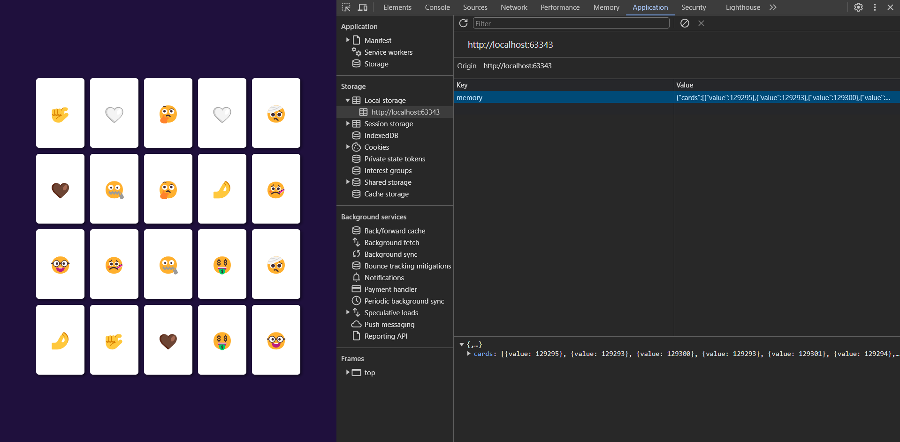

A chaque rechargement de la page les cartes restent à la même place.

Peu importe les action de fermeture de page les cartes restent a la même position.
Par contre avec 'sessionStorage' les cartes ne changent pas, seulement dans le même onglet.

## BONUS
### CARTE
On ajoute un attribut faceHidden à la classe Card.
```javascript
export class Card {

    #value;
    #faceHidden;

    constructor(value) {
        this.#value = value;
        this.#faceHidden = true;
    }

        .
        .
        .
}
```

On ajoute les méthodes show et hide à la classe Card.
```javascript
show()
{
    this.#faceHidden = false;
}
hide()
{
    this.#faceHidden = true;
}
```
On modifie la méthode displayCard de la classe ViewMemory pour afficher les cartes face cachée.
```javascript
displayCard(card,i){
        .
        .
        .
        if(card.faceHidden){
            div.classList.add("hidden");
        }
        .
        .
        .
}
```
On ajoute l'attribut faceHidden à la méthode toData de la classe Card.
```javascript
toData(){
        return {
            value: this.#value,
            faceHidden : this.#faceHidden
        }
    }
```

### MEMORY

```javascript
    showCard(index) {
        if (this.#cards[index].faceHidden === false) {
            return;
        }

        this.#cards[index].show();

        if (!this.#firstCard) {
            this.#firstCard = this.#cards[index];
        } else {
            if (this.#firstCard.value === this.#cards[index].value) {
                this.#firstCard = null;
                //save game here

            } else {
                setTimeout(() => {
                    this.#firstCard.hide();
                    this.#cards[index].hide();
                    this.#firstCard = null;
                }, 1);
            }
        }
        if (this.#cards.every(card => card.faceHidden === false)) {
            this.newGame(this.getCardsNumber()/2);
        }
    }
```
### CONTROLLER
On ajoute une méthode showCard à la classe ControllerMemory.
```javascript
showCard(index){
    this.#memory.showCard(index);
    this.notify()
}
```
### VUE 
On ajoute un EventListener à la div dans la méthode displayCard de la classe ViewMemory.
```javascript
div.addEventListener("click",() => this.#controllerMemory.showCard(i));
```

Jusqu'ici le jeu fonctionne correctement, on peut retourner les cartes et les cacher si elles ne correspondent pas. Mais les paires retournée ne sont pas sauvegardées.
En faisant quelques recherche je suis tombé sur les callbacks, qui permettent de passer une fonction en attribut d'une classe et de l'appeler dans une autre classe.

Dans la classe Memory on ajoute un attribut saveGameCallback et on l'appelle à cahque fois que q'une paire est retournée dans la méthode showCard.
```javascript
export class Memory{
    #cards;
    #firstCard = null;
    #saveGameCallback;
    constructor(saveGameCallback) {
        this.#cards = [];
        this.#saveGameCallback = saveGameCallback;
    }
    // ... 

    showCard(index) {
        // ... 

        this.#saveGameCallback();
    }
}
```

Dans la classe ControllerMemory on ajoute un attribut saveGameCallback et on le passe à la classe Memory.
```javascript
export class ControllerMemory extends Notifier
{
    #memory
    constructor()
    {
        super();
        this.#memory = new Memory(() => this.saveGame());
    }
    // ... 
}
```

Maintenant tout fonctionne correctement, les paires retournées sont sauvegardées dans le local storage.

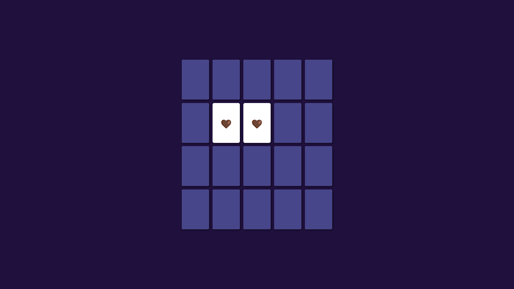

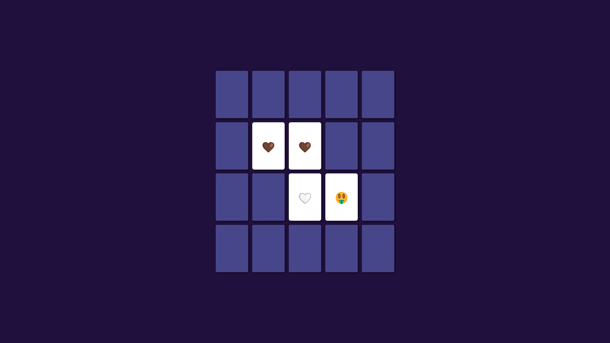

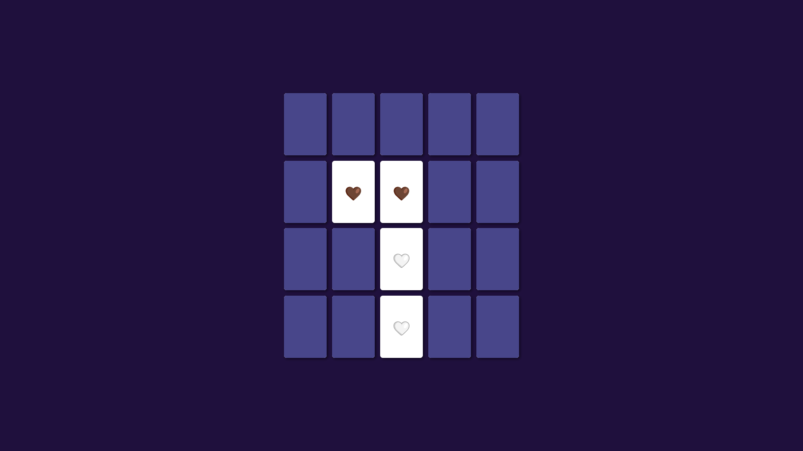

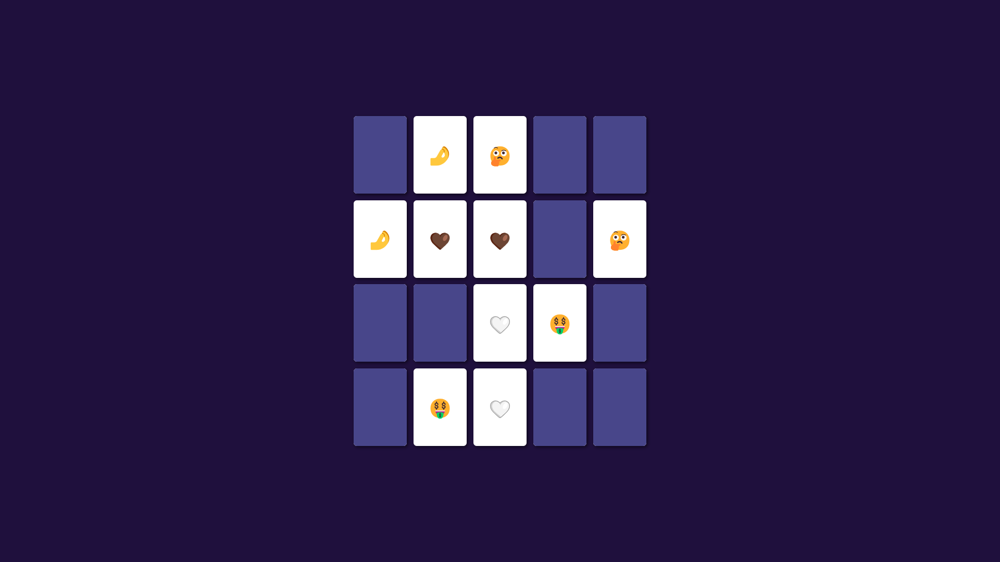

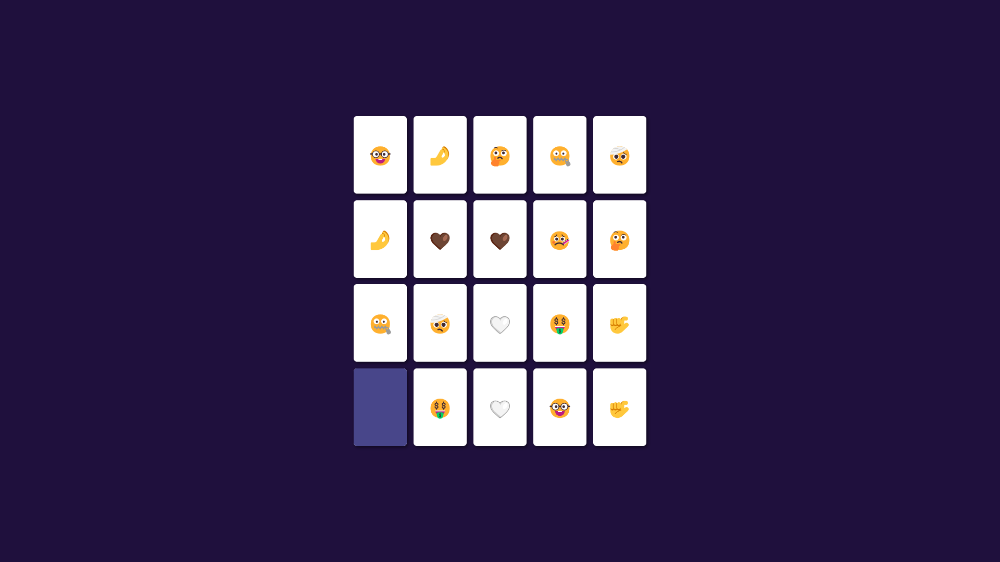

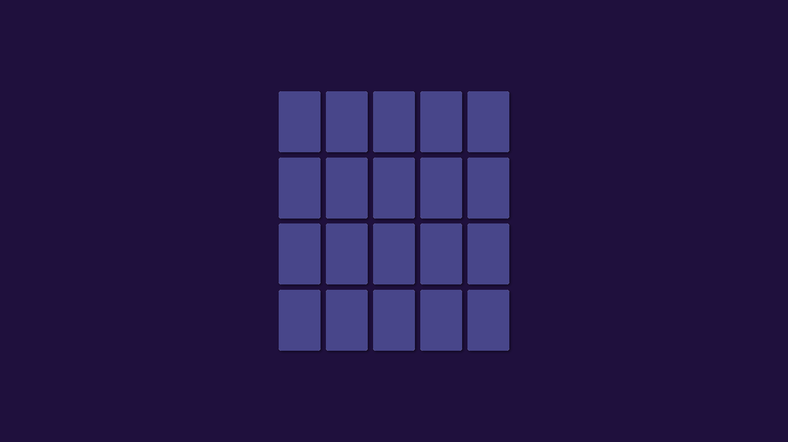

Quand on a retourné toutes les paires, un nouveau jeu est généré.

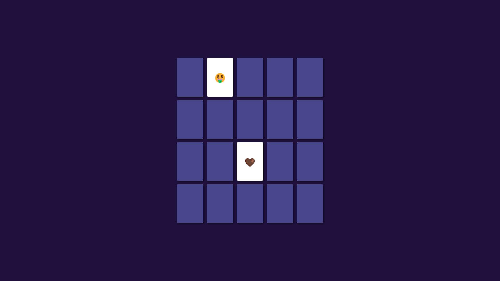

## CONCLUSION
En conclusion, ce TD m'a permis de manipuler les modules ES6, la programmation orientée objets, l'architecture Modèle/Vue/Contrôleur et l'API Web LocalStorage.
Le Bonus m'a permis de découvrir les callbacks et de les utiliser pour sauvegarder les paires retournées dans le local storage, j'avoue avoir passé beaucoup de temps sur le fonctionnement du jeu avec toute les conditions.